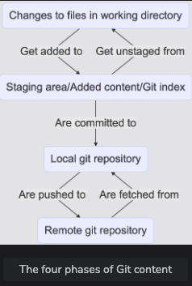

# GitCommands

## **Four stages of git**


## BASICS
---
1. Upstream - Repository from where source code is taken
2. Downstream - Repository that takes changes to the code from the upstream
3. branching is cheap - O(1) since it is just point to the current commit and does not copy all the files
4. Changes are made across the whole project but not per file
5. Commits are made across the whole projec

# GIT COMMANDS

`git init`
1. Locally initialise a database in .git folder and stores entire repository.
2. `HEAD` file is the key -> points to the current branch or commit ID you are currently on within your git repo
3. `config`  file contains information about repo's local config. i.e the branches and remote repo

### Setting up alias for git commands
```ruby
$ git config --global alias.co checkout
$ git config --global alias.br branch
$ git config --global alias.ci commit
$ git config --global alias.st status
$ git config --global alias.unstage 'reset HEAD --'
```

`git log`
1. Shows history of the repo

`git status`
1. Shows history of the repo

`touch gitcommands.md`
1. Creats gitCommands.md file

`git add`
1. tells git to start tracking the files in the local index

***`History will only be available once you commit`***

`git commit -m "Some message"`
1. Tells git to take a snapshot of all added content at this point from local index

`git diff`
1. Will show local changes which are not added yet

`git clone`

`git reset`
1. helps to return to previous or known state

`git log --oneline`  - Show concise history

`git log --oneline --graph` - Show visual representation of history

`git reset` - by default it remove staged/added files and place it back to your working directory - unstage area

`git reset --hard` - it will remove all the added and local(unstaged) changes and reverting you checkout to just commited stage


`git branch <Branch Name>`

`git branch` - shows all the branches

`git checkout <Branch Name>`

`git checkout <commitId>` - You can check out at a specific commit but now your HEAD will be detached means it is not pointing to any branch instead pointing to commit id

`git merge <Branch>` - Branch will be merged with checked out branch. It will find the First common ancestor and start merging commits after that. if two commits are changing the same line then it will add both in the file and will ask you to resolve the conflicts manually.

`git stash`

`git stash pop`

`git stash list`

`git stash show/apply <ID>`

`git stash show --patch stash@{0}` - it will show you top stash in the stack

`cat > file1 << END` - create a new file and write it o untill you enter END

`git reset --hard commitID` - brings back head to the given commit

`git cherry-pick [-edit][--no-commit][] <commit_id>` - if you want to add some commit to your current branch from another branch commit, you can cherry pick target commit and add it to your current branch

### Rebase
```markdown
0. `git rebase <Branch>`
1. Checkout to the branch in which you want to rebase
2. run git rebase `<BRANCH>` - BRANCH is the branch which you to rebase on your current branch.
3. resolve the conflicts
4. run `git rebase --continue`
5. `git commit -am "rebased branch a on branch b"`
6. `git push -f`


```
### Squash - To Squash the commits into a single commit
```
git rebase -i HEAD~3

This would open last 3 commits into interactive mode there you can pick or squash commits inot previous commit

Once this is done, you can rewrite commit
```

### Merge
`git merge master` - merge master into current branch

### Bisect
```python
$ git bisect start
$ git bisect bad                 # Current version is bad
$ git bisect good v2.6.13-rc2    # v2.6.13-rc2 is known to be good
```

`git clone <repolink> <directory>`

`git push --set-upstream origin abranch`

# provide the path for the repository you created on github
`git remote add origin https://github.com/YOUR-USERNAME/YOUR-REPOSITORY-NAME.git`

 
### Pull vs Fetch
```
git fetch updates your local repository only but git pull updates both local repo and your working directory
If get pull find some uncommited changes, it only update local repo and leave working directory as it is. you need to do git merge from you local repo to working directory
```

## OPTIONS
`--hard`

`--mixed`

`--inline`

`--all` - Shows all the branches

`--decorator` - Gives usful info about refs and tags about a commit

`--topo-order`


## Tags
Same as branches except they do not have history. you can create a tag at commit or at a branch

`git tag i_was_here`

`git tag remember_to_tell_bob_to_rewrite_this newfeature`

### NOTE
```
A branch is a pointer to the end of a line of changes. A tag is a pointer to a single change.
HEAD is where your Git repository is right now.
Detached HEAD means you are at a commit that has no
reference (branch or tag) associated with it.
```


